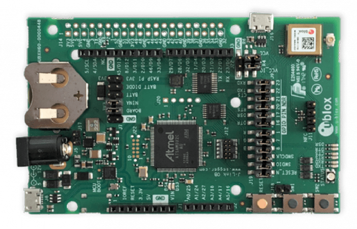

# EVK-NINA-B3 Board for Micropython

This is a board configuration for using mainline micropython with the UBLOX [EVK-NINA-B3](https://www.u-blox.com/en/product/evk-nina-b3) board for use with mainline Micropython



## How to setup

Just copy the __evk_nina_b3__ folder to **<_your-micropython-folder_>/ports/nrf/boards** and follow the same instructions for compiling any other nrf board, just setting the BOARD variable to _"evk_nina_b3".

Examples:

```sh
make BOARD=evk_nina_b3
make BOARD=evk_nina_b3 deploy
```

```sh
make BOARD=evk_nina_b3 SD=s140
make BOARD=evk_nina_b3 SD=s140 sd
```
